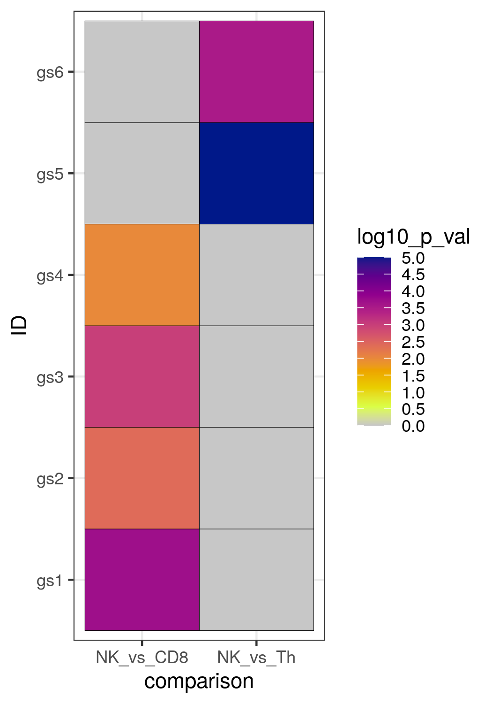

## **Bonus code** :champagne_glass:

The following code was added thanks to questions from course participants of past sessions. They might be useful for you too.


## msigdbr package

The [msigdbr](https://cran.r-project.org/web/packages/msigdbr/index.html) package hosted on CRAN allows to access gene set collections hosted on MSigDB directly within R. Check out its vignette to view how to download collections for other species such as mouse, etc. The function ```msigdbr_species()``` allows you to list available species. 

For example, to download the Hallmark collection with human gene symbols within R:
```r
gmt <- msigdbr::msigdbr(species = "human", category = "H")

# Create the 2 column-format (TERM2GENE argument) required by clusterProfiler:
h_gmt <- gmt[,c("gs_name", "gene_symbol")]

```


## Code for a heatmap of p-values with ggplot2

For heatmaps, ggplot2 can also be used. Here is an example for a heatmap of the p-values of 6 different gene sets (gs), and the
p-value for each gene set was calculated in two comparisons. Before using ggplot2, you need to create a dataframe that contains a column with the gene set identities, a column with the 
name of the cell type comparisons, and a column with the p-value of each gene set in each comparison. So a specific format is 
required for ggplot2.

```r
library(ggplot2)

# Create a data frame that contains the p-value for every gene set for every 
# cell type comparison. You need to include the values also for the non-significant
# gene sets.

# For the example, create a dummy data frame with the list of gene sets (gs), the
# 2 cell type comparisons, and the p-value for each gene set in each comparison:
ora_to_plot<-as.data.frame(cbind(ID=c("gs1", "gs2","gs3","gs4", "gs5", "gs6",
                                      "gs1", "gs2","gs3","gs4", "gs5", "gs6"),
                                 comparison=c(rep("NK_vs_Th",6), rep("NK_vs_CD8",6)),
                                 p_val=as.numeric(c(0.8,0.9,0.6, 0.054, 0.00001, 0.0003,
                                                    0.0002, 0.004, 0.001,0.01, 0.85,0.9))))

# transform the p-val to -log10(p-val):
ora_to_plot$log10_p_val<--log10(as.numeric(ora_to_plot$p_val))
# set the none-significant p-values to 0 so that they appear grey in the heatmap:
ora_to_plot$log10_p_val<-ifelse(ora_to_plot$log10_p_val<(-log10(0.05)), 0, ora_to_plot$log10_p_val)
range(ora_to_plot$log10_p_val) # [1]  0 5

head(ora_to_plot, n=12)
#     ID comparison p_val log10_p_val
# 1  gs1   NK_vs_Th   0.8    0.000000
# 2  gs2   NK_vs_Th   0.9    0.000000
# 3  gs3   NK_vs_Th   0.6    0.000000
# 4  gs4   NK_vs_Th 0.054    0.000000
# 5  gs5   NK_vs_Th 1e-05    5.000000
# 6  gs6   NK_vs_Th 3e-04    3.522879
# 7  gs1  NK_vs_CD8 2e-04    3.698970
# 8  gs2  NK_vs_CD8 0.004    2.397940
# 9  gs3  NK_vs_CD8 0.001    3.000000
# 10 gs4  NK_vs_CD8  0.01    2.000000
# 11 gs5  NK_vs_CD8  0.85    0.000000
# 12 gs6  NK_vs_CD8   0.9    0.000000

# create a palette of colors based on the Plasma palette (grDevices package)
plot(1:20, 1:20, col=hcl.colors(20,"Plasma"), pch=15, cex=3)
hcl.colors(9,"Plasma")# "RdYlGn")
breaks<-seq(from=0, to=5, by=0.5 )

color<-c("grey78", rev(hcl.colors(9,"Plasma")))

# create plot and export as png:
p<-ggplot(ora_to_plot, aes(comparison, ID, fill= log10_p_val)) + 
  geom_tile(color = "black") +
  scale_fill_gradientn(breaks= breaks, 
                       colors = color) +
  theme_bw() 
ggsave(plot = p, filename = "heatmap_p_value_ORA.png", 
       device="png",
       width = 4,height = 6)
```

You will obtain the following heatmap:
  
  <figure>
  
  </figure>