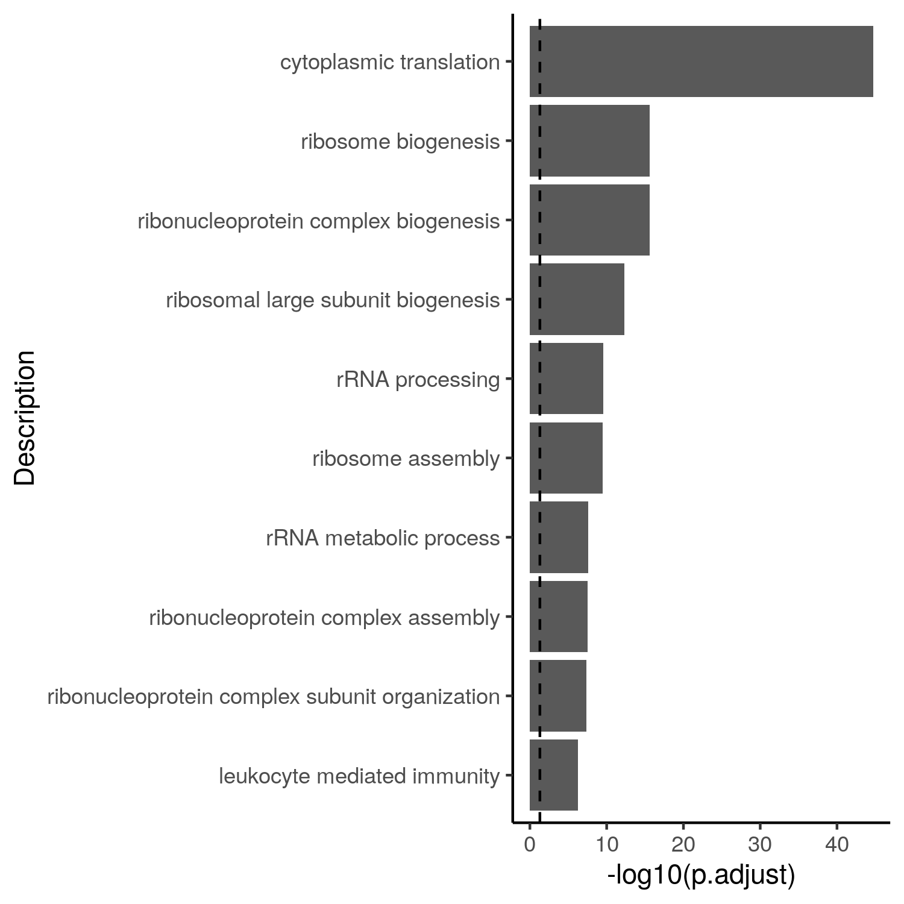

# Simple and multiple linear regression

In this section, you will find the R code that we will use during the course. We will explain the code and output during correction of the exercises.

Slides of lectures:

[Download slides](assets/pdf/EA_062022_TW_ad.pdf){: .md-button }

Data for exercises:

[Download data](assets/exercises/data.zip){: .md-button }

## Source of data

We will work with RNA sequencing data generated by [Ercolano et al 2020](https://jlb.onlinelibrary.wiley.com/doi/10.1002/JLB.5MA0120-209R). This study described the transcriptomes of immune cells that are circulating in the blood of humans in healthy conditions.  The differential gene expression analysis was performed using limma (see [Useful links](https://sib-swiss.github.io/enrichment-analysis-training/links/) page). 

Before starting the exercises, set the working directory to where you have downloaded and unzipped the [data folder](https://sib-swiss.github.io/enrichment-analysis-training/materials/) with the files for the exercises 
and load the necessary packages. 

!!! warning
    When using setwd(), change the path within quotes to where you have saved the data for the exercises


```r
# Change the path here:
setwd("/path/to/whereDataFolderIsSaved/")

library(clusterProfiler)
library(enrichplot)
library(pathview)
library(org.Hs.eg.db)
library(tidyverse)

# set seed
set.seed(1234)

```

## Exercise 1 - Over-representation analysis


Import the data into your R session and explore its structure: what are the different columns corresponding to?
How can you search for a particular gene within this table?

```r
# Import DE table:
NK_vs_Th<-read.csv("data/NK_vs_Th_diff_gene_exercise_1.csv",
                   header = T)
                   
# Look at the structure of the data.frame:
head(NK_vs_Th)

# Search for a gene symbol in the data.frame, eg NCAM1 (CD56)
NK_vs_Th[which(NK_vs_Th$symbol=="NCAM1"),]
``` 

This table contains the typical information obtained after differential gene expression analysis. For each gene, you have log<sub>2</sub> fold change values and significance information via the raw p-value and adjusted p-value. A positive log<sub>2</sub> fold change value indicates that the gene is more expressed in NK cells than in Th cells, while a negative log<sub>2</sub> fold change value indicates that the gene is less expressed in NK cells than in Th cells.
The p-value is usually computed automatically by R packages designed for differential gene expression analysis such as edgeR, limma or DESeq2. If you ever need to perform p-value adjustment, there is a function that is part of the stats package called p.adjust(), that allows you to perform p-value
adjustment for any list of p-values. Look at the help of the function and try to understand the arguments that can be used. 
```r
?p.adjust
```


We can compare the raw p-value and adjusted p-value for any gene. Raw p-values that are close to 0.05 will often become higher than 0.05 after adjustment,
while very small p-values more likely remain below 0.05 after adjustment. Search for 2 genes in the data.frame, CPS1 and GZMB, and verify the effect of adjustment on their p-values. Are both genes still significant after adjustment?

??? done "Answer"
	```r
  	NK_vs_Th[which(NK_vs_Th$symbol=="CPS1"),]

    NK_vs_Th[which(NK_vs_Th$symbol=="GZMB"),] 
	```

....


```r
length(which(NK_vs_Th$symbol %in% adaptive$gene)) # 513
```

To perform a Fisher's exact test, we need to build a contingency table of the number of genes that are up-regulated or not significant in Th cells, and that are part or not of the gene set of interest. First, count the number of genes up-regulated in Th cells (i.e. down-regulated in NK cells), then the number of not significant genes, then determine for each type of genes whether they are part of the adaptive immune response gene set or not.

??? done "Answer"
	```r
    # Extract the number of genes up-regulated in Th (i.e. down-regulated in NK):
    Th_up<-subset(NK_vs_Th, 
    NK_vs_Th$p.adj<=0.05&NK_vs_Th$logFC<0)
    # Are these genes part of the gene set?            
    summary(Th_up$symbol %in% adaptive$gene)
    #    Mode   FALSE    TRUE 
    # logical    1753     142 
    table(Th_up$symbol %in% adaptive$gene)

    # Extract the number of not significant genes:
    Th_not_DE<-subset(NK_vs_Th, NK_vs_Th$p.adj>0.05)
    # Are these genes part of the gene set?            
    summary(Th_not_DE$symbol %in% adaptive$gene)
    #    Mode   FALSE    TRUE 
    # logical   16344     289
    ```

Next, build a contingency table that has the following format:

|     	            |  Up-reg.   	| Not up-reg.   |
|-------	|-------	|-------	|
|  In gene set   	  |	    #        |	    #          |
|  Not in gene set 	|      #       |        #       | 


## Exercise 4 (the last one :sun_with_face: :scientist_tone3:) - Enrichment of other collections of gene sets

## Code for barplots with ggplot2

Barplot of the 10 most significant gene sets:

```r
library(tidyverse)

GO_NK_Th@result %>%
  dplyr::arrange(p.adjust) %>%
  slice_head(n = 10) %>%
  ggplot(aes(x = -log10(p.adjust), y = reorder(Description, -p.adjust))) +
    geom_bar(stat = "identity") +
    geom_vline(xintercept = -log10(0.05), linetype = "dashed") +
    labs(y = "Description") +
    theme_classic()

```
  <figure>
  
  </figure>


## Feedback :sparkle:
Thanks for attending this course! Don't forget to give honest feedback via the link sent by the course organizer.


## Extra exercise for ECTS credits
Please provide a report with answers to an extra exercise:


