# Simple and multiple linear regression

In this section, you will find the R code that we will use during the course. We will explain the code and output during correction of the exercises.

Slides of lectures:

[Download slides Morning Lecture](assets/pdf/Intro and linear models - 160821.pdf){: .md-button }

[Download slides Afternoon Lecture](assets/pdf/Beyond linearity.pdf){: .md-button }

Data for exercises:

[Download full data for the week](assets/exercises/exercises-all.zip){: .md-button }


## Source of data

We created a (non-existing) class of students for which you have some information. The name of the students, their gender, the age, the height and the weight of those adolescent students are provided. 

Before starting the exercises, set the working directory to where you have downloaded and unzipped the [data folder](https://sib-swiss.github.io/advanced-statistics/materials/) with the files for the exercises 
and load the necessary packages. 

!!! warning
    When using setwd(), change the path within quotes to where you have saved the data for the exercises. Make sure to always be in the right folder for the exercises.


```r
# Change the path here:
setwd("/path/to/whereDataFolderIsSaved/")

# Load the libraries needed for this exercise
# Here only plotting libraries are needed

library(ggplot2)
library(car)


```

## Simple linear models and simple multiple linear models
### The class data set


Import the data into your R session and explore its structure: what are the different columns corresponding to?
Is the table in a usable format ?

```r
# Load the class table
class <- read.table("exercises/class.txt")

# Have a look
summary(class[,-1])
```

Here we see a problem for the Gender, what is it ? Can you correct for it ?

??? done "Answer"
    ```r
    #Gender is a "character" variable and should be a factor
    class$Gender[class$Gender == "F"] <- 0
    class$Gender[class$Gender == "M"] <- 1
    class$Gender <- as.numeric(class$Gender)
    ```
Now we make use of the function pairs (do not know it? look it up with the help!). We then create a simple linear model using Age to describe the height of our students, have a look at the summary of this regression, then plot it.

```r
pairs(class[,-1])
```
<figure>
  
  </figure>


```r
model <- lm(Height ~ Age, data=class)
summary(model)
plot(class$Age, class$Height, xlim=c(0,20), ylim=c(0,200))
abline(model, col="red", lwd=2)
#putting the xlim to 0 we can visually see the intercept
```

<figure>
  
  </figure>
  
Are there any influencial points ? Do they have something special? What do you do with them ?

```r
hat <- lm.influence(model)
plot(hat$hat)

car::influencePlot(model, xlab="Hat-Values", ylab="Studentized Residuals")
```
<figure>
  
  </figure>
  
<figure>
  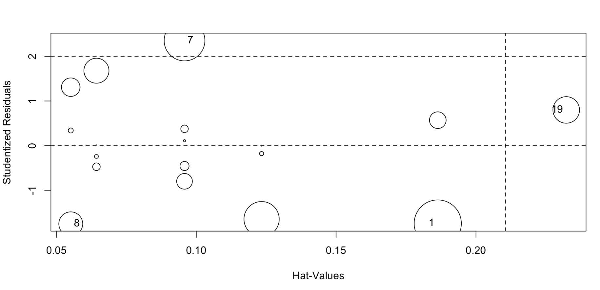
  </figure>
  
Use the predict function to calculate a confidence interval.

```r
new_age <- seq(11, 16, by=0.25)
plot(class$Age, class$Height,pch=20,col="black")
points(class$Age[c(7,19)],class$Height[c(7,19)],col="green")
conf_interval <- predict.lm(model, newdata=data.frame(Age=new_age), interval="confidence", level = 0.95)
lines(new_age, conf_interval[,2], col="blue", lty=2)
lines(new_age, conf_interval[,3], col="blue", lty=2)

pred_interval <- predict(model, newdata=data.frame(Age=new_age), interval="prediction", level = 0.95)
lines(new_age, pred_interval[,2], col="orange", lty=2)
lines(new_age, pred_interval[,3], col="orange", lty=2)
```
<figure>
  
  </figure>
  
Now model the Height with the weight, with a combination of age and weight as well as age and gender allowing for a possible interaction.
```r
model.2 <- lm(Height ~ Weight, data=class)
summary(model.2)

model.3 <- lm(Height ~ Age + Weight, data=class)
summary(model.3)

model.4 <- lm(Height ~ Age + Gender, data=class)
summary(model.4)

model.5 <- lm(Height ~ Age * Gender, data=class)
summary(model.5)
``` 

### The hellung dataset

Again load the data in the ISwR package called hellung and have a look at the help to understand the data.
```r
library(ISwR)
data(hellung)
?hellung
```
Plot the diameter of the Tetrahymena cells in relationship with the concentration of those cells. Do you have any clear evidence of what to model ? 
```r
plot(hellung$diameter, hellung$conc, 
     xlab="Diameter", ylab="Concentration")
```
<figure>
  
  </figure>

Do a linear model between concentration and diameter, check all the assumption. Is anything violated ?
```r
model <- lm(conc ~ diameter, data=hellung)
summary(model)

abline(model)

qqnorm(residuals(model))
qqline(residuals(model))
ks.test(residuals(model), "pnorm")

influencePlot(model, xlab="Hat-Values", ylab="Studentized Residuals")
```
<figure>
  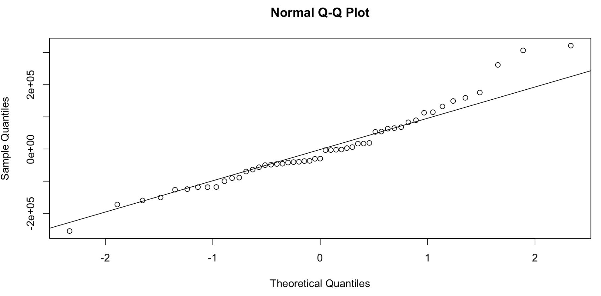
  </figure>
  
  <figure>
  
  </figure>
We therefore need to adapt our model. In the first plot the data seemed to have a logarithmic pattern. We will try if this helps in modelling the data.
```r
logconc <- log(hellung$conc)
plot(hellung$diameter, logconc, 
     xlab="Diameter", ylab="log(concentration)")

modellog <- lm(logconc ~ diameter, data=hellung)
summary(modellog)

abline(modellog)
```
<figure>
  
  </figure>

We also test the different assumptions.
```r
plot(fitted(modellog), residuals(modellog))
qqnorm(residuals(modellog))
qqline(residuals(modellog))
ks.test(residuals(modellog), "pnorm")
```
<figure>
  
  </figure>

Now we can add glucose to the equation. What are your conclusions ?
```r
modellog.2 <- lm(logconc ~ diameter + glucose, data=hellung)
summary(modellog.2)
```


## Beyond linearity


Again load the data this time in the SemiPar package called janka, attach the object janka to have an easier access to the variables and have a look at the help of the janka data. 


```r
library(SemiPar)
data(janka)
attach(janka)
```

Plot the data using the log of the hardness.
```r
plot(dens,log(hardness), ylab="response", xlab="X", main="Janka data")
```

<figure>
  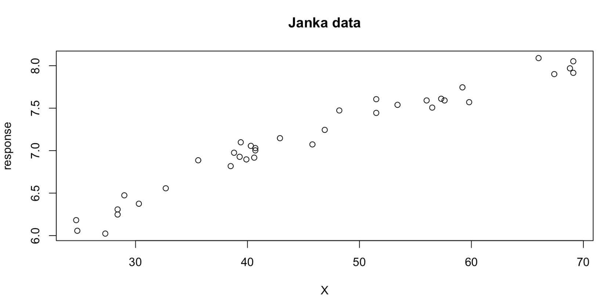
  </figure>

### Linear fit
Start with a linear regression, plot the estimated fit and have a look at the residuals vs. fitted values. What do you observe ?
```r
# fit a linear model
fit.linear <- lm( log(hardness) ~ dens )

# plot the estimated linear fit
abline(fit.linear, lwd=2, col="red")

# let's also look at residuals vs. fitted values
plot(fit.linear$fitted.values, fit.linear$residuals,
     ylim=c(-max(range(fit.linear$residuals)),max(range(fit.linear$residuals))),
     ylab="residuals", xlab="fitted values")
```
<figure>
  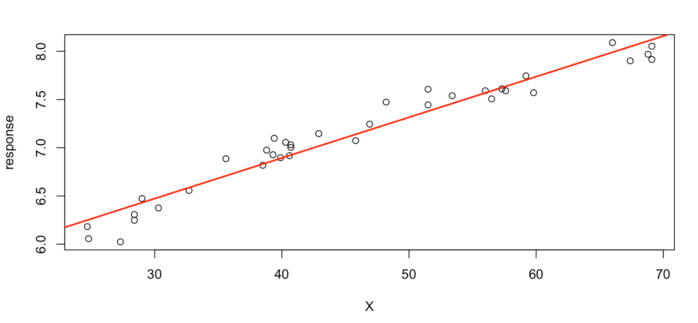
  </figure>

Now you realise something seems off. Can you try to show it visually ? 
??? Answer
    ```r
    # we want the error terms to be normally distributed around zero, so let's add that to the plot
    abline(a=0, b=0, col="blue", lwd=2)

    # another way to assess the residual plot is to use a scatterplot smoother that captures the trend in residuals
    # scatter.smooth uses loess algorithm for local weighted regression
    scatter.smooth(fit.linear$fitted.values, fit.linear$residuals,
    ylim=c(-max(range(fit.linear$residuals)),max(range(fit.linear$residuals))),
               ylab="residuals", xlab="fitted values",
               lpars=list(col="blue", lwd=2, lty=2))
    abline(a=0, b=0, col="blue", lwd=2)
    legend(7.6,0.22,"loess fit",lty=2, col="blue", cex=0.75)
    ```
    <figure>
    
    </figure>
  
### Quadratic fit

The last smooth curve showed a quadratic pattern. We will try to see if we can improve the fit using the poly function and a quadratic model y = ax^2+bx+c.

We will plot the estimated fit. To do so, we need to predict the fit at desired points on the X axis (let's call it the grid). After creating the grid, we can use predict() to estimate the fitted model on the specified grid. The arguments of the predict() function can vary depending on the object class of the fit, but R detects the appropriate predict function automatically. For example, there are predict.lm(), predict.glm(), predict.poly(), etc. The list goes on and on! In this case we feed an object of class "lm" to predict() so you can use ?predict.lm to get more info about the arguments usage/needed.

```r
# plot raw data
plot(dens,log(hardness), ylab="response", xlab="X")

# fit a quadratic model
fit.quad <- lm( log(hardness) ~ poly(dens, degree=2) ) 

# plot the estimated linear fit
# create a grid
dens.range <- range(dens)
dens.grid <- seq(from=dens.range[1], to=dens.range[2], length.out=100)

# predict
predict_fit.quad <- predict(fit.quad, newdata=data.frame(dens=dens.grid))
plot(dens,log(hardness), ylab="response", xlab="X")
lines(dens.grid, predict_fit.quad, col="red", lwd=2)
```
<figure>
  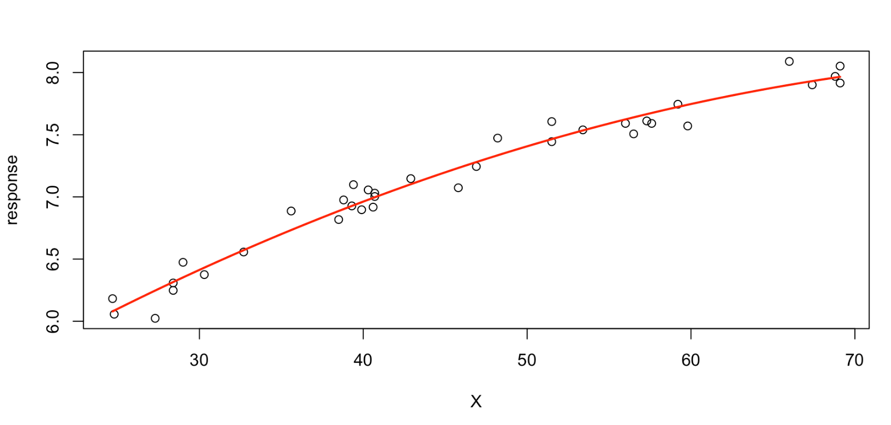
  </figure>
  
Seems good, but are the assumptions met ?
Check the residuals vs. fitted values plot

```r
plot(fit.quad$fitted.values, fit.quad$residuals, 
     ylim=c(-max(range(fit.quad$residuals)),max(range(fit.quad$residuals))), 
     ylab="residuals", xlab="fitted values")
abline(a=0, b=0, col="blue", lwd=2)
```
Here some more information on the arguments required by predict().
First, you need to specify the model you're trying to predict from. Depending on the class of the fit object (e.g. lm, glm, etc.), R will then invoke a particular predict method.
The second optional argument is "newdata", a data frame to let R know at which values of the predictor(s) you would want to make the predictions.
Always make sure the variable names in newdata are the same as in the model.
If newdata is omitted, by default predictions are made based on the data used for the fit (observed data).
The accuracy or precision of our estimates can be expressed in terms of a confidence interval (CI) or a prediction interval (PI).
Here is a link where these intervals are nicely explained: https://www.graphpad.com/support/faq/the-distinction-between-confidence-intervals-prediction-intervals-and-tolerance-intervals/
By setting the "interval" argument to either "confidence" or "prediction" predict() will return the requested interval along the fitted values.
If you would rather do the calculations manually, you can get the standard errors on your predictions as well by setting the argument se.fit to TRUE.
We will come back to intervals later. Let's move on with a LOESS smoothing of our points to assess whether the quadratic fit improved our residual plot. Looks much better, don't you agree?

```r
scatter.smooth(fit.quad$fitted.values, fit.quad$residuals,
               ylim=c(-max(range(fit.quad$residuals)),max(range(fit.quad$residuals))),
               ylab="residuals", xlab="fitted values",
               lpars=list(col="blue", lwd=2, lty=2))
abline(a=0, b=0, col="blue", lwd=2)
legend(6.2,-0.1,"loess fit",lty=2, col="blue", cex=0.75)
```
<figure>
  
  </figure>
  
Again load the data again in the SemiPar package (so load it if not yet done so) called lidar (Light detection and ranging (LIDAR) data), attach the object lidar to have an easier access to the variables and have a look at the help of the lidar data. Start to plot the range vs logratio. 

```r
library(SemiPar)
data(lidar)
attach(lidar)

# plot raw data
plot(range,logratio, ylab="response", xlab="X")
```


  
A linear and quadratic fit are clearly not appropriate for the lidar data, so let's start from polynomial degree 3. Try fitting polynomials of degree 3, 4, and 10 to lidar data

### Cubic fit

Now it should be "easy" to fit a polynomial of degree 3 as well as setting a grid and plotting predictions. Not yet easy? check the answer below.

??? Answer 

    ```r
    # fit a cubic model
    fit.cubic <- lm( logratio ~ poly(range,3) )

    # set up the grid
    range.range <- range(range)
    range.grid <- seq(from=range.range[1], to=range.range[2], length.out=100)

    # use predict() to estimated the model at desired points on the X-axis (i.e. the grid)
    predict_fit.cubic <- predict(fit.cubic, newdata=data.frame(range=range.grid))
    plot(range,logratio, ylab="response", xlab="X")
    lines(range.grid, predict_fit.cubic, col="red", lwd=2)
    ```
    <figure>
    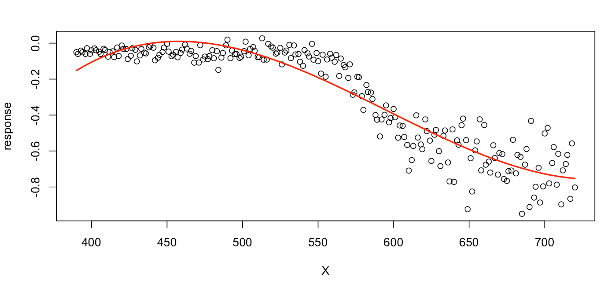
    </figure>
What about the residuals ? Here also for the experts we hide the answer, for those of you that are less familiar the answer is below. 

??? Answer
    ```r
    plot(fit.cubic$fitted.values, fit.cubic$residuals, 
     ylim=c(-max(range(fit.cubic$residuals)),max(range(fit.cubic$residuals))), 
     ylab="residuals", xlab="fitted values")
    scatter.smooth(fit.cubic$fitted.values, fit.cubic$residuals,
               ylim=c(-max(range(fit.cubic$residuals)),max(range(fit.cubic$residuals))),
               ylab="residuals", xlab="fitted values",
               lpars=list(col="blue", lwd=2, lty=2))
    abline(a=0, b=0, col="blue", lwd=2)
    ```
    <figure>
    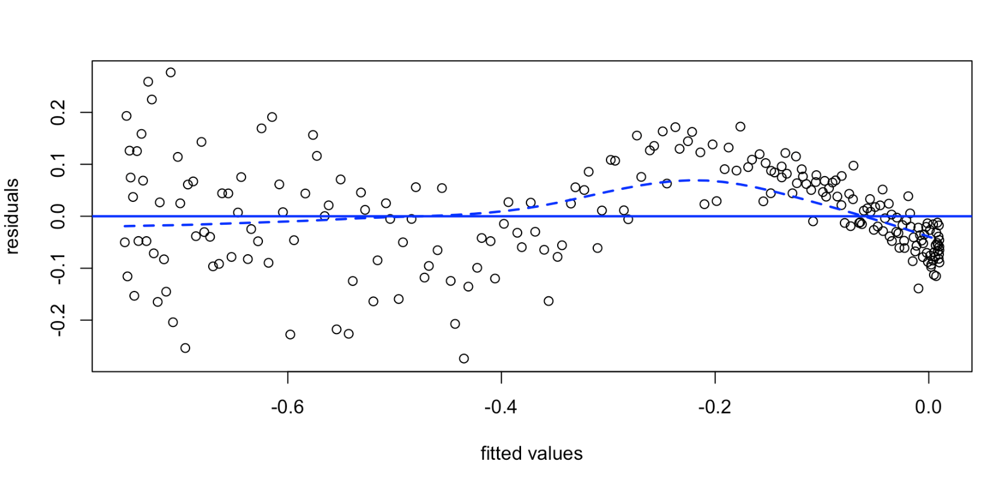
    </figure>
The conclusion is that we can definitely still do better!
    
### Polynomial degree 4 and 10

Plot the data and fit a polynomial of degree 4. Check the prediction and assumptions. 
??? Answer
    ```r
    # plot raw data
    plot(range,logratio, ylab="response", xlab="X")

    # fit a quadratic model
    fit.quad <- lm( logratio ~ poly(range,4) )

    # set up the grid
    range.range <- range(range)
    range.grid <- seq(from=range.range[1], to=range.range[2], length.out=100)

    # make predictions on the grid
    predict_fit.quad <- predict(fit.quad, newdata=data.frame(range=range.grid))
    lines(range.grid, predict_fit.quad, col="red", lwd=2)

    # residual plot
    plot(fit.quad$fitted.values, fit.quad$residuals, 
     ylim=c(-max(range(fit.quad$residuals)),max(range(fit.quad$residuals))), 
     ylab="residuals", xlab="fitted values")
    scatter.smooth(fit.quad$fitted.values, fit.quad$residuals,
               ylim=c(-max(range(fit.quad$residuals)),max(range(fit.quad$residuals))),
               ylab="residuals", xlab="fitted values",
               lpars=list(col="blue", lwd=2, lty=2))
    abline(a=0, b=0, col="blue", lwd=2)
    ```
    <figure>
    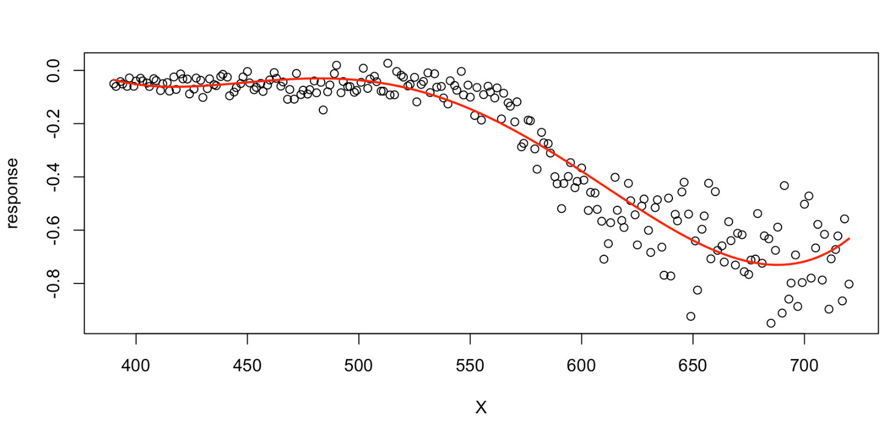
    </figure>
    <figure>
    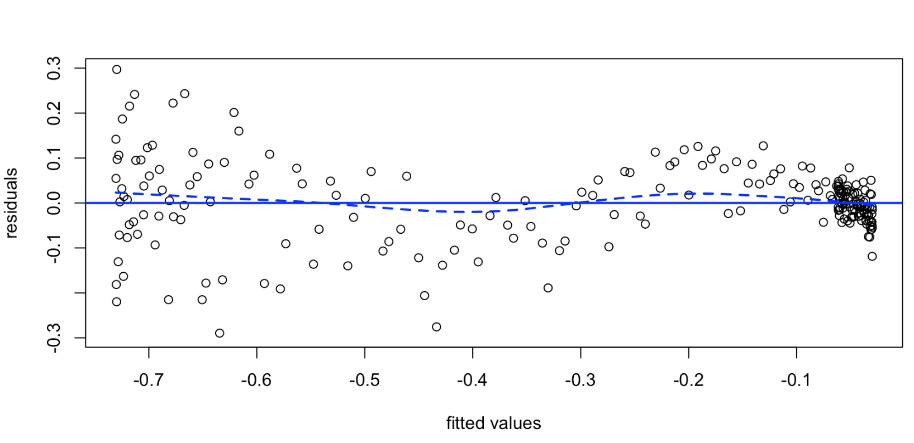
    </figure>
    
What is next ? Plot the data and fit a polynomial of degree 10. Check the prediction and assumptions. 

??? Answer
    ```r
    # plot raw data
    plot(range,logratio, ylab="response", xlab="X")

    # fit a polynomial degree 10
    fit.poly10 <- lm( logratio ~ poly(range,10) )

    # set up the grid
    range.range <- range(range)
    range.grid <- seq(from=range.range[1], to=range.range[2], length.out=100)

    # make predictions on the grid
    predict_fit.poly10 <- predict(fit.poly10,   newdata=list(range=range.grid))
    lines(range.grid, predict_fit.poly10, col="red", lwd=2)

    # residual plot
    plot(fit.poly10$fitted.values, fit.poly10$residuals, 
     ylim=c(-max(range(fit.poly10$residuals)),max(range(fit.poly10$residuals))), 
     ylab="residuals", xlab="fitted values")
    scatter.smooth(fit.poly10$fitted.values, fit.poly10$residuals,
               ylim=c(-max(range(fit.poly10$residuals)),max(range(fit.poly10$residuals))),
               ylab="residuals", xlab="fitted values",
               lpars=list(col="blue", lwd=2, lty=2))
    abline(a=0, b=0, col="blue", lwd=2)

    # remove the junk
    rm(fit.cubic, fit.quad, fit.poly10, predict_fit.cubic, predict_fit.quad, predict_fit.poly10, range.range, range.grid)
    ```
    <figure>
    
    </figure>
    <figure>
    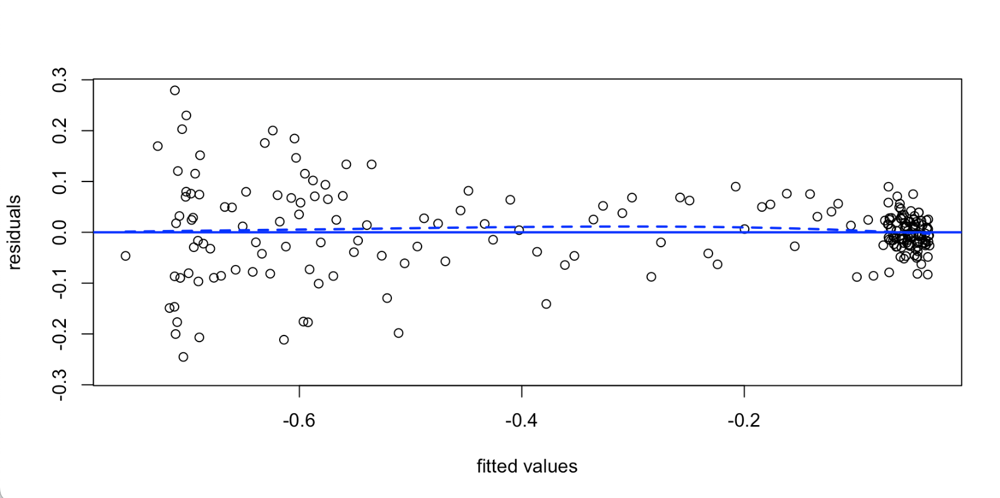
    </figure>
Seems like the polynomial of degree 10 is fitting well the assumptions on the residuals!

### Confidence and prediction intervals

Using the prediction with the polynomial of degree 3 try to calculate the confidence and prediction interval.
```r
# plot raw data
plot(range,logratio, ylab="response", xlab="X")

# fit the model
fit.cubic <- lm( logratio ~ poly(range,3) )

# set up the grid
range.range <- range(range)
range.grid <- seq(from=range.range[1], to=range.range[2], length.out=100)

# use the interval argument to fetch confidence intervals
predict_fit.cubic <- predict(fit.cubic, newdata=data.frame(range=range.grid), interval="confidence")

# keep in mind that confidence level is by default set to 0.95, but of course can be modified via the "level" argument
lines(range.grid, predict_fit.cubic[,"fit"], col="red", lwd=2)
lines(range.grid, predict_fit.cubic[,"lwr"], col="red", lwd=2, lty=2)
lines(range.grid, predict_fit.cubic[,"upr"], col="red", lwd=2, lty=2)

# alternatively we can write our own code to compute confidence intervals using the standard errors of the estimates
predict_fit.cubic <- predict(fit.cubic, newdata=list(range=range.grid), se.fit=TRUE)

# plot raw data
plot(range,logratio, ylab="response", xlab="X")

# plot the estimated fit
lines(range.grid, predict_fit.cubic$fit, col="red", lwd=2)

# compute and plot confidence bands
lines(range.grid, predict_fit.cubic$fit + 2 * predict_fit.cubic$se.fit, col="red", lwd=2, lty=2)
lines(range.grid, predict_fit.cubic$fit - 2 * predict_fit.cubic$se.fit, col="red", lwd=2, lty=2)

# use the interval argument to fetch prediction intervals
predict_fit.cubic <- predict(fit.cubic, newdata=data.frame(range=range.grid), interval="prediction")

lines(range.grid, predict_fit.cubic[,"lwr"], col="blue", lwd=2, lty=3)
lines(range.grid, predict_fit.cubic[,"upr"], col="blue", lwd=2, lty=3)
```
<figure>
  
  </figure>

### Step functions


```r
plot(range,logratio, ylab="response", xlab="X")

table(cut(range, breaks=3)) # note that you need to specify the number of breaking points
# (390,500] (500,610] (610,720] 
# 74        74        73

fit.pwsf <- lm( logratio ~ cut(range,breaks=3) )
summary(fit.pwsf)

plot(range,logratio, ylab="response", xlab="X")
range.range <- range(range)
range.grid <- seq(from=range.range[1], to=range.range[2], length.out=100)
predict_fit.pwsf <- predict(fit.pwsf, newdata=list(range=range.grid), se.fit=TRUE)
lines(range.grid, predict_fit.pwsf$fit, col="red", lwd=2)
lines(range.grid, predict_fit.pwsf$fit + 2 * predict_fit.pwsf$se.fit, col="red", lwd=2, lty=2)
lines(range.grid, predict_fit.pwsf$fit - 2 * predict_fit.pwsf$se.fit, col="red", lwd=2, lty=2)
```
<figure>
  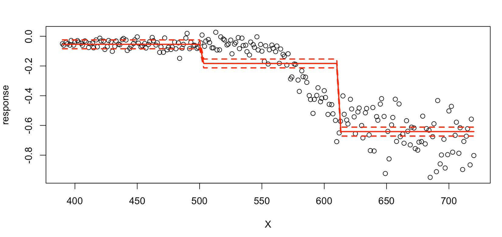
  </figure>
### Piecewise linear fits

```r
fit.left.linear.1knot <- lm( logratio ~ range, subset=(range<575) )
fit.right.linear.1knot <- lm( logratio ~ range, subset=(range>=575) )

summary(fit.left.linear.1knot)
summary(fit.right.linear.1knot)

# plot raw data
plot(range,logratio, ylab="response", xlab="X")
range.range <- range(range)
range.grid.left <- seq(from=range.range[1], to=575, length.out=50)
range.grid.right <- seq(from=575, to=range.range[2], length.out=50)

# predict the fit on the grid
# left
predict_fit.left.linear.1knot <- predict(fit.left.linear.1knot, newdata=list(range=range.grid.left), se.fit=TRUE)
lines(range.grid.left, predict_fit.left.linear.1knot$fit, col="red", lwd=2)
lines(range.grid.left, predict_fit.left.linear.1knot$fit + 2 * predict_fit.left.linear.1knot$se.fit, col="red", lwd=2, lty=2)
lines(range.grid.left, predict_fit.left.linear.1knot$fit - 2 * predict_fit.left.linear.1knot$se.fit, col="red", lwd=2, lty=2)
# right
predict_fit.right.linear.1knot <- predict(fit.right.linear.1knot, newdata=list(range=range.grid.right), se.fit=TRUE)
lines(range.grid.right, predict_fit.right.linear.1knot$fit, col="red", lwd=2)
lines(range.grid.right, predict_fit.right.linear.1knot$fit + 2 * predict_fit.right.linear.1knot$se.fit, col="red", lwd=2, lty=2)
lines(range.grid.right, predict_fit.right.linear.1knot$fit - 2 * predict_fit.right.linear.1knot$se.fit, col="red", lwd=2, lty=2)
# indicate the breakpoint
abline(v=575, col="blue", lwd=2, lty=2)
```
<figure>
  
  </figure>
  
### Piecewise cubic fits

```r
fit.left.cubic.1knot <- lm( logratio ~ poly(range,3), subset=(range<575) )
fit.right.cubic.1knot <- lm( logratio ~ poly(range,3), subset=(range>=575) )

summary(fit.left.cubic.1knot)
summary(fit.right.cubic.1knot)

# plot raw data
plot(range,logratio, ylab="response", xlab="X")
range.range <- range(range)
range.grid.left <- seq(from=range.range[1], to=575, length.out=50)
range.grid.right <- seq(from=575, to=range.range[2], length.out=50)

# predict the fit on the grid
# left
predict_fit.left.cubic.1knot <- predict(fit.left.cubic.1knot, newdata=list(range=range.grid.left), se.fit=TRUE)
lines(range.grid.left, predict_fit.left.cubic.1knot$fit, col="red", lwd=2)
lines(range.grid.left, predict_fit.left.cubic.1knot$fit + 2 * predict_fit.left.cubic.1knot$se.fit, col="red", lwd=2, lty=2)
lines(range.grid.left, predict_fit.left.cubic.1knot$fit - 2 * predict_fit.left.cubic.1knot$se.fit, col="red", lwd=2, lty=2)
# right
predict_fit.right.cubic.1knot <- predict(fit.right.cubic.1knot, newdata=list(range=range.grid.right), se.fit=TRUE)
lines(range.grid.right, predict_fit.right.cubic.1knot$fit, col="red", lwd=2)
lines(range.grid.right, predict_fit.right.cubic.1knot$fit + 2 * predict_fit.right.cubic.1knot$se.fit, col="red", lwd=2, lty=2)
lines(range.grid.right, predict_fit.right.cubic.1knot$fit - 2 * predict_fit.right.cubic.1knot$se.fit, col="red", lwd=2, lty=2)
# indicate the breakpoint
abline(v=575, col="blue", lwd=2, lty=2)
```
<figure>
  
  </figure>
### Linear splines

```r
library(splines)

?bs

fit.ls.1knot <- lm( logratio ~ bs(range, knots=575, degree=1) )
summary(fit.ls.1knot)

# plot raw data
plot(range,logratio, ylab="response", xlab="X")
range.range <- range(range)
range.grid <- seq(from=range.range[1], to=range.range[2], length.out=100)

# predict the fit on the grid
predict_fit.ls.1knot <- predict(fit.ls.1knot, newdata=list(range=range.grid), se.fit=TRUE)
lines(range.grid, predict_fit.ls.1knot$fit, col="red", lwd=2)
lines(range.grid, predict_fit.ls.1knot$fit + 2 * predict_fit.ls.1knot$se.fit, col="red", lwd=2, lty=2)
lines(range.grid, predict_fit.ls.1knot$fit - 2 * predict_fit.ls.1knot$se.fit, col="red", lwd=2, lty=2)
abline(v=575, col="blue", lwd=2, lty=2)

# repeat above with 2 internal knots at desired points
fit.ls.2knots <- lm( logratio ~ bs(range, knots=c(550,600), degree=1) )
summary(fit.ls.2knots)

# plot raw data
plot(range,logratio, ylab="response", xlab="X")
range.range <- range(range)
range.grid <- seq(from=range.range[1], to=range.range[2], length.out=100)

# predict the fit on the grid
predict_fit.ls.2knots <- predict(fit.ls.2knots, newdata=list(range=range.grid), se.fit=TRUE)
lines(range.grid, predict_fit.ls.2knots$fit, col="red", lwd=2)
lines(range.grid, predict_fit.ls.2knots$fit + 2 * predict_fit.ls.2knots$se.fit, col="red", lwd=2, lty=2)
lines(range.grid, predict_fit.ls.2knots$fit - 2 * predict_fit.ls.2knots$se.fit, col="red", lwd=2, lty=2)
abline(v=c(550,600), col="blue", lwd=2, lty=2)
```
<figure>
  
  </figure>
  <figure>
  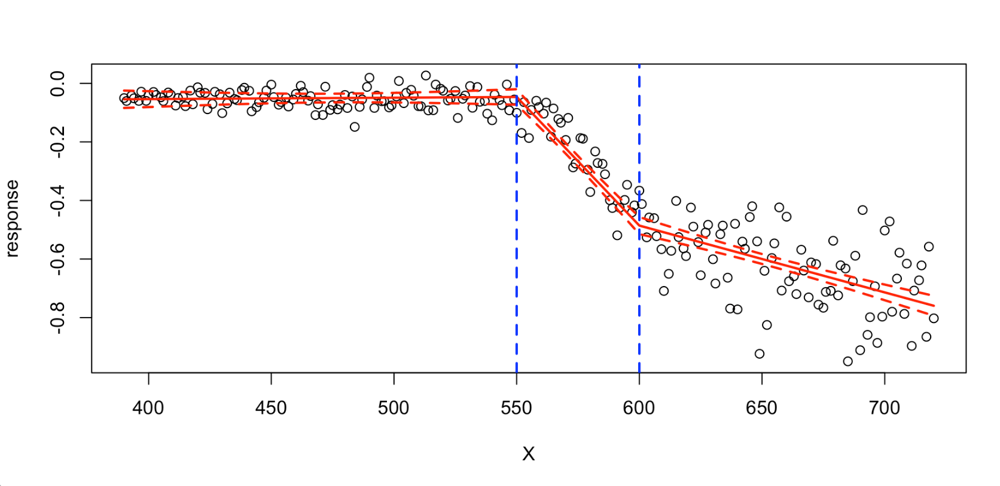
  </figure>
  
### Cubic splines

```r
# fit cubic splines with 1 internal knot
fit.cs.1knot <- lm( logratio ~ bs(range, knots=575) )
summary(fit.cs.1knot)

# plot raw data
plot(range,logratio, ylab="response", xlab="X")
range.range <- range(range)
range.grid <- seq(from=range.range[1], to=range.range[2], length.out=100)

# predict the fit on the grid
predict_fit.cs.1knot <- predict(fit.cs.1knot, newdata=list(range=range.grid), se.fit=TRUE)
lines(range.grid, predict_fit.cs.1knot$fit, col="red", lwd=2)
lines(range.grid, predict_fit.cs.1knot$fit + 2 * predict_fit.cs.1knot$se.fit, col="red", lwd=2, lty=2)
lines(range.grid, predict_fit.cs.1knot$fit - 2 * predict_fit.cs.1knot$se.fit, col="red", lwd=2, lty=2)
abline(v=575, col="blue", lwd=2, lty=2)

# fit cubic splines with 2 internal knots
fit.cs.2knots <- lm( logratio ~ bs(range, knots=c(550,600)) )
summary(fit.cs.2knots)

# plot raw data
plot(range,logratio, ylab="response", xlab="X")
range.range <- range(range)
range.grid <- seq(from=range.range[1], to=range.range[2], length.out=100)

# predict the fit on the grid
predict_fit.cs.2knots <- predict(fit.cs.2knots, newdata=list(range=range.grid), se.fit=TRUE)
lines(range.grid, predict_fit.cs.2knots$fit, col="red", lwd=2)
lines(range.grid, predict_fit.cs.2knots$fit + 2 * predict_fit.cs.2knots$se.fit, col="red", lwd=2, lty=2)
lines(range.grid, predict_fit.cs.2knots$fit - 2 * predict_fit.cs.2knots$se.fit, col="red", lwd=2, lty=2)
abline(v=c(550,600), col="blue", lwd=2, lty=2)
```
<figure>
  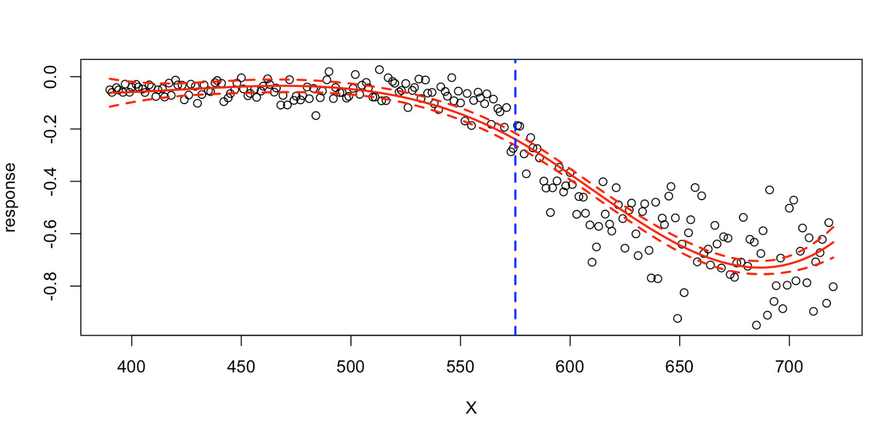
  </figure>
  
  <figure>
  
  </figure>
  
### Compare the goodness of fit of each model

```r
mse = function(model){
  rmse = sqrt(mean(model$residual^2))
  round(rmse, 3)
}
mse_fit.ls.1knot = mse(fit.ls.1knot)
mse_fit.ls.2knots = mse(fit.ls.2knots)
mse_fit.cs.1knot = mse(fit.cs.1knot)
mse_fit.cs.2knots = mse(fit.cs.2knots)

model_name = c("linear splines with 1 knot", "linear splines with 2 knots", 
               "cubic splines with 1 knot", "cubic splines with 2 knots")
mses = c(mse_fit.ls.1knot, mse_fit.ls.2knots,
         mse_fit.cs.1knot, mse_fit.cs.2knots)
mse_table = cbind(model_name, mses)
colnames(mse_table) = c("Models", "RMSE")
knitr::kable(mse_table, caption = "Mean squared errors for different models", digits = 3, "simple")
```

  
### Smoothing/natural splines

```r

fit.ss <- smooth.spline(range, logratio)
fit.ss

# plot raw data
plot(range, logratio, ylab="response", xlab="X")
range.range <- range(range)
range.grid <- seq(from=range.range[1], to=range.range[2], length.out=length(range))

# predict the fit on the grid
?predict.smooth.spline
predict_fit.ss <- predict(fit.ss, newdata=list(range=range.grid))
lines(predict_fit.ss$x, predict_fit.ss$y, col="red", lwd=2)
```
<figure>
  
  </figure>
  

```r
# bootstrap standard errors
# helper functions borrowed from: 
# https://stackoverflow.com/questions/23852505/how-to-get-confidence-interval-for-smooth-spline

# Helper functions
resampler <- function(data) {
  n <- nrow(data)
  resample.rows <- sample(1:n,size=n,replace=TRUE)
  return(data[resample.rows,])
}

spline.estimator <- function(data,m=100) {
  fit <- smooth.spline(x=data[,1],y=data[,2], cv=T)
  eval.grid <- seq(from=min(data[,1]),to=max(data[,1]),length.out=m)
  return(predict(fit,x=eval.grid)$y) # We only want the predicted values
}

spline.cis <- function(data,B,alpha=0.05,m=100) {
  spline.main <- spline.estimator(data,m=m)
  spline.boots <- replicate(B,spline.estimator(resampler(data),m=m))
  cis.lower <- 2*spline.main - apply(spline.boots,1,quantile,probs=1-alpha/2)
  cis.upper <- 2*spline.main - apply(spline.boots,1,quantile,probs=alpha/2)
  return(list(main.curve=spline.main,lower.ci=cis.lower,upper.ci=cis.upper,
              x=seq(from=min(data[,1]),to=max(data[,1]),length.out=m)))
}

# sample data
data <- data.frame(x=range, y=logratio)

# run and plot
sp.cis <- spline.cis(data, B=10000, alpha=0.05)
plot(data[,1],data[,2], ylab="response", xlab="X")
lines(x=sp.cis$x,y=sp.cis$main.curve, col="red")
lines(x=sp.cis$x,y=sp.cis$lower.ci, lty=2, lwd=2, col="red")
lines(x=sp.cis$x,y=sp.cis$upper.ci, lty=2, lwd=2, col="red")
```
<figure>
  
  </figure>